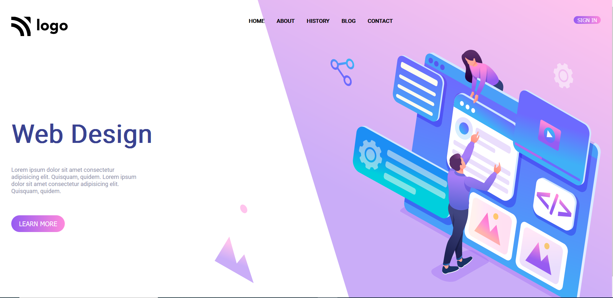

# Project 8 - HTML and CSS

By Ankan

Here's the Website

## What I learned from this Project?

- This project was a very good learning experience for me.
- I learned how to use HTML and CSS to create a beutiful website.
- In this project I learn about flexbox and aligining items.

## This project took around 1.5 hours to complete.
